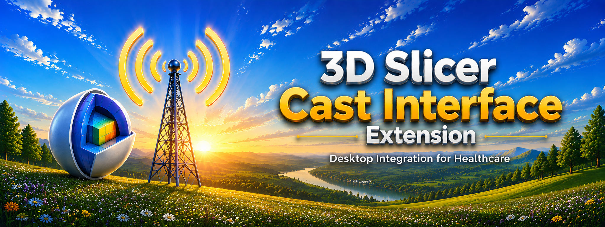
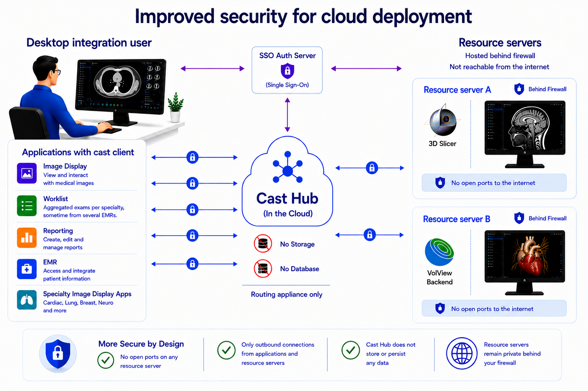

# 3D Slicer Cast Interface Extension

<p align="center">
  
</p>


---

## Overview

Cast Interface is a 3D Slicer extension focused on desktop integration workflows for healthcare applications.


---

## Features
Resource servers: Resource servers subscribe to all user topics for dicom/nifti events and send back results to the user throuh the hub. Each server has its own onMessage script. The script handles producing the results from the DICOM files received and publishes a dicom-send event back to the user topic.

Image Display Client: The image display client provide a PACS client type interface to the 3D slicer viewer. Supported events should be ImagingStudy-open, Imaging-Study-close, dicom-send and request for sceneview.

Hub: The hub is the server that distributes the messages and handles the data transfer requests over the websocket connection to each client.

---
## Background

What is Cast?
Cast is an offshoot of FHIRcast (<https://fhircast.hl7.org/>). FHIRcast is the standard replacing Epic’s file drop interface for integration with PACS and reporting systems. It provides a secure messaging infrastructure using a hub with websocket subscriptions.

Cast differs to FHIRcast in it;s goals and features.

Goal: 

Cast is focused on desktop integration of healthcare applications. It is not restricted to a specific data format.  Cast is also not restricted to a specific authentication mechanism; it expects that apps will authenticate with the customer's system. Cast aims to provide a general framework that can support all use cases by adding data types with verbs (events), for example, nifti-send.


Features: 

In addition to FHIRcast events, the cast hub allows the following:

 - Request data from applications such as worklist context, report content, DICOM instance, DICOM tag, JPEG/PNG screenshots, scene views, etc.

 - Support for binary files transfer; therefore payloads other than FHIR/JSON, such as DICOM, PNG, NIFTi, openEHR, OpenIGTLink.

 - Group topics for multi-user workflows, such as tumor boards or interventional procedures.
Support for IHE roles.

 - Support three additional subscription data: 
 -- subscriber.product.name, 
 -- subscriber.product.version,
 -- subscriber.actors
 
 - Support four additional event data: 
 -- subscriber.name
 -- subscriber.actor
 -- target.actor
 -- target.product.name


For testing and development, the hub provides a test mock auth endpoint that assigns a user  when none is provided.  A “single-user” mode is available for stand-alone applications that do not use authentication.   The hub mock auth endpoints are the same as keycloak to facilitate integration.


Hub availability and complexity are possibly  the main obstacle to the deployment of this technology; therefore the hub is kept as simple as possible and only handles message handling. The cast_api.py script used for  Volview server and 3D slicer is @2000 lines and the admin.html portal as well.


The cast hub does not support context management.  Context is to be retrieved from the relevant applications directly through the request mechanism.   In cast, the hub is a routing appliance only.  It does not look at event data; it has no storage or database;  only distribution logic.   The context management paradigm was tried 30 years ago with CCOW ( <https://en.wikipedia.org/wiki/CCOW> ).  We have to acknowledge that today all advanced radiology integrations function without a context management server. They manage with events obtained through a combination of file drops, postMessages, URL with parameters, EXEs with command-line parameters and socket to to socket.  

There is value to being able to obtain real-time information from other applications in the workfow.  For example, knowing the "sceneview" status of an Image Display application or the current content of the report editor.  This  is different than what a FHIRcast hub would know since it is relies on getting events which are not generated for each keystoke/click. 

## Security Benefits for Service Providers

This architecture protects service providers by eliminating direct inbound internet exposure entirely.
<p align="center">
  
</p>

Each resource server establishes only **outbound encrypted connections** to the Cast Hub, which functions exclusively as a lightweight **routing and session coordination appliance**. Because no inbound ports need to be opened on hospital or enterprise networks, the resource servers remain protected behind existing firewalls and are never directly reachable from the public internet. 

The Cast Hub maintains:

- No persistent storage
- No database
- No long-term data retention
- No exposed clinical infrastructure

This significantly reduces the overall attack surface and minimizes operational security risk.  It also simplifies providing reources since the IT department does not need to open ports on their router.  Since the resource servers are not on the internet, you will get shared keys for the auth server.  The hub can use domain name certificates.


In theory, the hub can be cloud deployed as a serverless application.  In practice, many of those low cost offerings do not support websocket services and a docker based offering is necessary like  Azure WebApps or AWS elastic beanstalk.  

For high availibity deployment a  hot stand-by configuraiton can be configured.  The "reset server" button in the hub admin portal allows testing workflow behavior during failover.

## Installation

### Install from the 3D Slicer Extension Manager

1. Open **3D Slicer**
2. Open the **Extension Manager**
3. Search for **Cast Interface**
4. Click **Install**
5. Restart 3D Slicer

---

## Repository Assets

Recommended repository structure:

```text
/docs
  /images
    banner.png
    social-preview.png
    icon.png
```

-

## License

Apache 2.0 License

---

## Acknowledgements

* 3D Slicer community
* Open-source healthcare ecosystem
* Medical imaging interoperability initiatives
